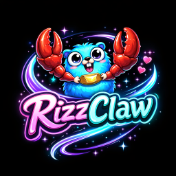
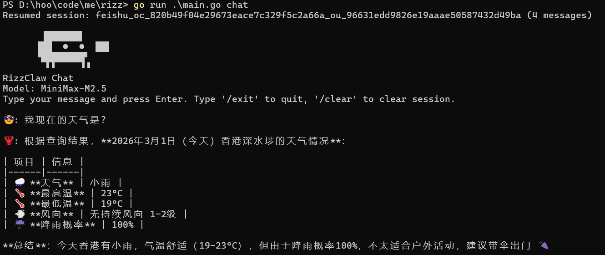

# RizzClaw 🐾

<p align="center">
  
</p>

<p align="center">
  <strong>AI-Powered Coding Assistant</strong>
</p>

<p align="center">
  <a href="https://github.com/hoorayman/rizzclaw">
    
  </a>
  <a href="https://go.dev/">
    
  </a>
</p>

## Introduction

RizzClaw is an AI-powered intelligent coding assistant built on [MiniMax](https://www.minimaxi.com/) large language models. It helps developers with various tasks including code writing, debugging, file operations, web search, and more.

## ✨ Core Features

### 🧠 Smart Session Management (Auto-Summary)

RizzClaw features an intelligent session compression mechanism that automatically manages context windows during long conversations:

- **Auto-Compression Trigger**: Compression is triggered when session tokens exceed the threshold (default: 50% of 128K)
- **Smart Summary Generation**: Early conversations are compressed into concise summaries, preserving key information while significantly reducing token usage
- **Configurable Parameters**:
  - `MaxTokens`: Maximum token limit (default: 128000)
  - `MaxHistoryShare`: Maximum share of history messages (default: 0.5)
  - `MinMessagesToKeep`: Number of recent messages to keep (default: 10)
  - `ChunkRatio`: Compression ratio (default: 0.4)

```
┌─────────────────────────────────────────────────────────────┐
│  Session History                                             │
├─────────────────────────────────────────────────────────────┤
│  [Summary] Summary of 50 earlier messages...                │
│  [Summary] Summary of 30 mid-session messages...            │
├─────────────────────────────────────────────────────────────┤
│  [Recent] User: Help me refactor this function              │
│  [Recent] Assistant: Sure, let me help you...               │
│  ...                                                         │
└─────────────────────────────────────────────────────────────┘
```

### 💾 Long-term Memory System (BM25 + RAG)

RizzClaw implements an advanced hybrid retrieval memory system supporting long-term knowledge storage and intelligent recall:

#### Hybrid Retrieval Architecture

```
                    ┌──────────────────┐
                    │   User Query      │
                    └────────┬─────────┘
                             │
              ┌──────────────┼──────────────┐
              ▼              ▼              ▼
     ┌────────────────┐ ┌────────────────┐
     │  Vector Search │ │  BM25 Keyword  │
     │  (Semantic)    │ │  (Exact Match) │
     └───────┬────────┘ └───────┬────────┘
             │                  │
             │    ┌─────────────┘
             ▼    ▼
     ┌────────────────────┐
     │   Score Fusion     │
     │  Vector: 0.7       │
     │  Keyword: 0.3      │
     └─────────┬──────────┘
               ▼
     ┌────────────────────┐
     │   MMR Reranking    │
     │   (Optional)       │
     └─────────┬──────────┘
               ▼
     ┌────────────────────┐
     │   Temporal Decay   │
     │   (Optional)       │
     └─────────┬──────────┘
               ▼
         Final Results
```

#### Core Technologies

| Technology | Description |
|------------|-------------|
| **BM25 Full-text Search** | Built on SQLite FTS5, supports Chinese and English keyword search with precise matching of key terms in user queries |
| **Vector Semantic Search** | Supports embedding model integration for semantic-level similarity search, understanding query intent beyond keyword matching |
| **Hybrid Score Fusion** | Vector search weight 0.7 + keyword search weight 0.3, fully customizable |
| **MMR Diversity Reranking** | Maximal Marginal Relevance algorithm avoids overly similar results, improving information coverage |
| **Temporal Decay** | Based on exponential decay function, older memories have lower weights with default 30-day half-life |
| **Evergreen Memory** | Memories marked as Evergreen never decay, ideal for storing user preferences, project context, and other long-term information |

#### Memory Storage

```go
type MemoryEntry struct {
    ID          string    // Unique identifier
    Content     string    // Memory content
    Embedding   []float32 // Vector embedding
    Keywords    []string  // Extracted keywords
    Source      string    // Source (e.g., "MEMORY.md", "conversation")
    CreatedAt   time.Time // Creation timestamp
    IsEvergreen bool      // Whether it's an evergreen memory
}
```

#### Search Configuration

```go
type SearchOptions struct {
    MaxResults     int     // Maximum number of results (default: 6)
    MinScore       float64 // Minimum score threshold (default: 0.35)
    VectorWeight   float64 // Vector search weight (default: 0.7)
    KeywordWeight  float64 // Keyword search weight (default: 0.3)
    UseMMR         bool    // Enable MMR (default: false)
    MMRLambda      float64 // MMR relevance weight (default: 0.7)
    TemporalDecay  bool    // Enable temporal decay (default: true)
    HalfLifeDays   float64 // Temporal decay half-life (default: 30 days)
}
```

### 🛠️ Other Features

- 🤖 **AI-Powered** - Built on advanced MiniMax M2.1/M2.5 large language models
- 📁 **Rich Tools** - Built-in file operations, code execution, web search, and more
- ⚡ **Skill System** - Support for loading custom skill extensions

### 🔍 Web Search

- **DuckDuckGo Integration** - Uses DuckDuckGo HTML search instead of Bing for better accessibility
- **Proxy Support** - Automatically reads proxy configuration from environment variables:
  - `HTTP_PROXY` / `http_proxy` - HTTP proxy
  - `HTTPS_PROXY` / `https_proxy` - HTTPS proxy
  - `NO_PROXY` / `no_proxy` - Bypass proxy for specific hosts

## Tech Stack

- **Language**: Go 1.23+
- **CLI Framework**: [Cobra](https://github.com/spf13/cobra)
- **Configuration**: [Viper](https://github.com/spf13/viper)
- **Database**: SQLite3 (memory storage)
- **Full-text Search**: SQLite FTS5 (BM25)
- **LLM Provider**: MiniMax API

## Quick Start

### Screenshot

<p align="center">
  
</p>

### Installation

```bash
# Clone the project
git clone https://github.com/hoorayman/rizzclaw.git
cd rizzclaw

# Build
go build -o rizzclaw ./main.go

# Run
./rizzclaw chat
```

### Configuration

1. Copy the example config file:

```bash
cp config.example.json ~/.rizzclaw/config.json
```

2. Edit `config.json` and add your MiniMax API Key:

```json
{
  "models": {
    "mode": "merge",
    "providers": {
      "minimax": {
        "baseUrl": "https://api.minimaxi.com/anthropic",
        "apiKey": "API_KEY",
        "api": "anthropic-messages",
        "models": [
          {
            "id": "MiniMax-M2.1",
            "name": "MiniMax M2.1",
            "reasoning": false,
            "input": ["text"],
            "cost": {
              "input": 0.3,
              "output": 1.2,
              "cacheRead": 0.03,
              "cacheWrite": 0.12
            },
            "contextWindow": 200000,
            "maxTokens": 8192
          },
          {
            "id": "MiniMax-M2.1-lightning",
            "name": "MiniMax M2.1 Lightning",
            "reasoning": false,
            "input": ["text"],
            "cost": {
              "input": 0.3,
              "output": 1.2,
              "cacheRead": 0.03,
              "cacheWrite": 0.12
            },
            "contextWindow": 200000,
            "maxTokens": 8192
          },
          {
            "id": "MiniMax-M2.5",
            "name": "MiniMax M2.5",
            "reasoning": true,
            "input": ["text"],
            "cost": {
              "input": 0.3,
              "output": 1.2,
              "cacheRead": 0.03,
              "cacheWrite": 0.12
            },
            "contextWindow": 200000,
            "maxTokens": 8192
          },
          {
            "id": "MiniMax-M2.5-Lightning",
            "name": "MiniMax M2.5 Lightning",
            "reasoning": true,
            "input": ["text"],
            "cost": {
              "input": 0.3,
              "output": 1.2,
              "cacheRead": 0.03,
              "cacheWrite": 0.12
            },
            "contextWindow": 200000,
            "maxTokens": 8192
          },
          {
            "id": "MiniMax-VL-01",
            "name": "MiniMax VL 01",
            "reasoning": false,
            "input": ["text", "image"],
            "cost": {
              "input": 0.3,
              "output": 1.2,
              "cacheRead": 0.03,
              "cacheWrite": 0.12
            },
            "contextWindow": 200000,
            "maxTokens": 8192
          }
        ]
      }
    }
  },
  "agents": {
    "defaults": {
      "model": {
        "minimax/MiniMax-M2.5": {
          "primary": "minimax/MiniMax-M2.5",
          "alias": "Minimax"
        }
      },
      "timeout": 120
    }
  }
}
```

### Usage

```bash
# Show help
rizzclaw --help

# Start interactive chat
rizzclaw chat

# List available models
rizzclaw models

# Show current configuration
rizzclaw config show
```

### Interactive Commands

In chat mode, the following commands are available:

| Command | Description |
|---------|-------------|
| `/exit` or `/quit` | Exit the conversation |
| `/clear` | Clear current session history |
| `/help` | Show help information |

## Project Structure

```
rizzclaw/
├── cmd/                # CLI command entry
│   └── root.go         # Root command and chat command
├── internal/           # Internal packages
│   ├── agent/          # Agent core logic
│   │   ├── agent.go    # Agent implementation
│   │   └── session.go  # Session management
│   ├── llm/            # LLM client abstraction
│   ├── tools/          # Tool collection
│   ├── context/        # Context management
│   │   ├── manager.go  # Context manager
│   │   ├── session.go  # Session storage & compression
│   │   ├── memory.go   # Memory storage & retrieval
│   │   └── types.go    # Type definitions
│   ├── minimax/        # MiniMax API integration
│   └── config/         # Configuration management
├── docs/               # Documentation resources
│   └── pics/           # Image resources
└── main.go             # Program entry point
```

## Supported Models

| Model Name | Type | Context Window | Max Output |
|------------|------|----------------|------------|
| MiniMax-M2.1 | Text | 200K | 8K |
| MiniMax-M2.1-lightning | Text | 200K | 8K |
| MiniMax-M2.5 | Reasoning | 200K | 8K |
| MiniMax-M2.5-Lightning | Reasoning | 200K | 8K |
| MiniMax-VL-01 | Multimodal | 200K | 8K |

## Data Storage Location

All data is stored in the `.rizzclaw` folder in the user's home directory:

```
~/.rizzclaw/
├── config.json        # Configuration file
├── memory.db          # Memory database (SQLite)
├── sessions/          # Session storage
│   └── session-*.jsonl
└── context/           # Context files
    ├── MEMORY.md      # Long-term memory
    ├── USER.md        # User preferences
    └── ...
```

## License

MIT License - See [LICENSE](LICENSE) file for details

---

<p align="center">Made with ❤️ by RizzClaw</p>
